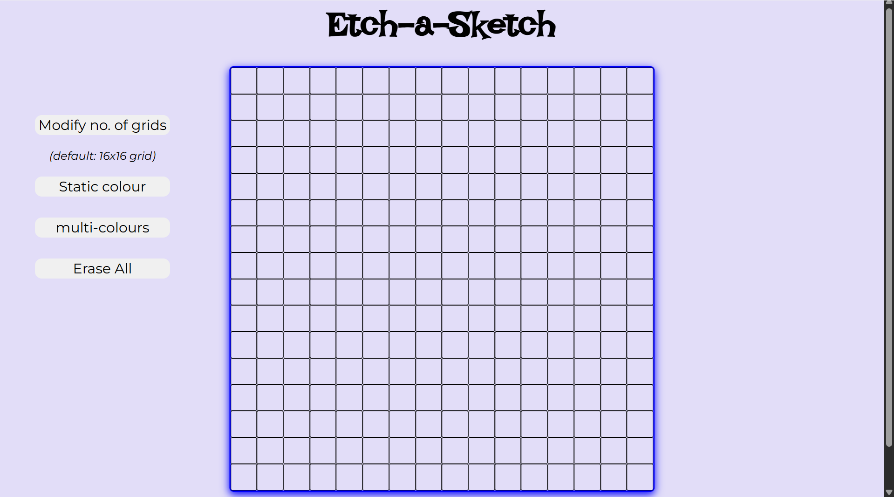
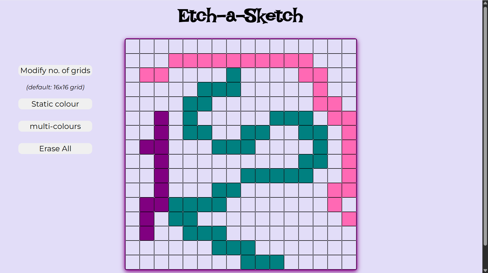

# Etch-a-Sketch

A simple digital drawing canvas built as part of **The Odin Project** curriculum. Practice drawing by clicking and dragging on the grid.

## Live Preview

[View Live Demo](https://piyushb-27.github.io/Etch-a-Sketch)

### Screenshots

## Features

- **Draw on Grid** - Click and drag to color squares  
- **Change Grid Size** - Modify grid from 1×1 to 100×100  
- **Drawing Modes** - Static color or rainbow mode  
- **Clear Canvas** - Reset the drawing area

## Technologies Used

- HTML5  
- CSS3  
- JavaScript

## How to Use

1. Choose a drawing mode (Static Color or Rainbow)  
2. Click and drag on the grid to draw  
3. Use "Modify Grid" to change canvas size  
4. Click "Clear Canvas" to erase

## Learning Goals

This project helped me practice:
- DOM manipulation  
- Event handling  
- CSS styling and animations  
- JavaScript functions

---

**Part of [The Odin Project](https://www.theodinproject.com/) curriculum**
